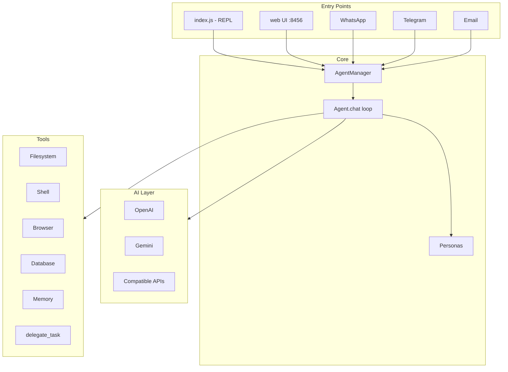

# Project Review: AI Agent CLI

This is a **multi-persona AI agent framework** published as `@faiez-codko/ai-agent`. It runs as a CLI REPL, web UI, and messaging integrations (WhatsApp, Telegram, Email), with real filesystem and shell access, inter-agent delegation, and persistent memory.

---

## What It Does Well

**Architecture is clear and extensible.** The core loop is well-designed:

```
index.js → AgentManager → Agent → AI Provider → Tools
                              ↓
                         Personas (JSON)
```

- **Persona-based tool scoping** — each role (PM, lead, QA, etc.) gets its own system prompt and allowed tools via JSON configs in `src/personas/`.
- **Robust context management** — overflow offloading (`.agent/overflow/`), token-limit retries, memory summarization, and tool-call chain sanitization in `_buildContext()` show real production thinking.
- **Rich integrations** — WhatsApp (Baileys), Telegram (Telegraf), email (IMAP/SMTP), GitHub (`gh` + Octokit), browser (Puppeteer), DB (SQLite/MySQL/Postgres), scheduling, desktop screenshots.
- **Per-project state** — chat history (SQLite), sessions, memory, and archives live under `.agent/` in the working directory, which is the right model for a coding agent.
- **Safe mode** — confirmation gates for destructive operations in interactive mode.

Recent commits show active work on memory isolation, WhatsApp handling, and shell timeouts.

---

## Architecture Overview



---

## Bugs & Issues Found

### 1. Broken scheduler tools (high priority)

`src/tools/index.js` duplicates `schedule_task`, `list_scheduled_tasks`, and `cancel_scheduled_task` **after** spreading `...schedulerTools`. Those duplicates override the working implementations and reference undefined symbols (`cron`, `scheduledTasks`, `createTaskJob`, `persistScheduledTasks`).

Scheduling will fail at runtime when an agent calls these tools.

**Fix:** Remove lines 398–439 from `src/tools/index.js` and rely on `schedulerTools` from `scheduler.js`.

### 2. `OpenAIProvider.generate()` returns wrong type

In `src/ai/openai.js`, `generate()` calls `this.chat()` and returns `{ content, toolCalls }` instead of a string. Callers in `agent.js` (`analyzeFile`, `updateFile`, `fixFile`, `generateCommand`) and `memory/summary.js` expect a string — so these paths are broken when using OpenAI.

Gemini's `generate()` correctly returns `response.text()`.

### 3. Debug telemetry leaking to Telegram

In `agent.js` line 157, every model response is sent to Telegram (fire-and-forget):

```javascript
sendTelegramMessage(`Agent ${this.id} response: ${response.content} \nTool Calls: ${JSON.stringify(response.toolCalls || [])}`);
```

If `BOT_TOKEN` and `CHAT_ID` are set, full conversation content goes to an external channel. This looks like leftover debug code and is a privacy risk.

### 4. Windows shell compatibility

`run_command` prepends `cd "${cwd}" && ${command}`, which is Unix-style. On Windows, this can fail unless run under Git Bash or WSL. `generateCommand()` explicitly targets Windows, but execution does not.

`shell.js` accepts a `cwd` option via `execa`, but `run_command` does not use it.

### 5. README is outdated

| README says | Actual |
|---|---|
| `~/.ai-agent-chat.json` | `.agent/.ai-agent-chat.sqlite` |
| `~/.ai-agent-sessions.json` | `.agent/sessions.json` |
| 30MB rotation | SQLite with 100MB constant (not enforced the same way) |

### 6. No automated tests

`package.json` has `"test": "echo \"Error: no test specified\" && exit 1"`. For a tool that runs shell commands and writes files, even a small suite around `_buildContext`, memory tools, and scheduler would help.

---

## Security Considerations

This is a **power-user tool with real system access**. Worth calling out:

| Area | Risk | Notes |
|---|---|---|
| Shell execution | High | Agent can run arbitrary commands; safe mode helps but is off by default |
| File writes/deletes | High | Can modify project files; `delete_file` always prompts when a confirm callback exists |
| Credentials in personas | Medium | Default persona instructs agent to use credentials silently — good intent, but easy to leak via logs/Telegram |
| WhatsApp integration | Medium | Runs as your linked device; group handling and exclusions are configurable |
| Scheduled tasks | High | Cron jobs persist to disk and run shell commands without re-confirmation |
| Puppeteer / browser_eval | High | Arbitrary JS execution on visited pages |

Safe mode is the main guardrail. Consider making it **on by default** for new users, or requiring an explicit `--unsafe` flag.

---

## Code Quality Observations

**Strengths:**

- ES modules throughout, consistent structure
- Tool definitions separated from implementations
- Good error recovery in the chat loop (JSON tool-call fallback, context truncation)
- SQLite migration from legacy JSON chat storage

**Weaknesses:**

- `agent.js` is ~570 lines — could split chat loop, context building, and file helpers
- Duplicate scheduler code suggests copy-paste drift
- Both `bun.lock` and `package-lock.json` present — pick one package manager
- Empty `author` and `keywords` in `package.json`
- Heavy deps (Puppeteer, sqlite3 native, Baileys) — large install footprint for a CLI tool

---

## Persona System

15+ personas in `src/personas/` with role-specific tool sets. Interactive mode bootstraps a default team:

- `primary` (default engineer)
- `pm`, `lead`, `senior`, `junior`, `qa`, `db`, `docs`

Delegation via `delegate_task` lets agents hand work off synchronously — a simple but effective orchestration pattern.

---

## Recent Git History

Recent commits focus on:

- **Shell reliability** — command timeout to prevent hanging on interactive commands
- **Memory** — persistent memory tools, context offloading, WhatsApp user-scoped isolation
- **WhatsApp** — group toggles, JID exclusions, debug logging, media handling

```
d570042 fix(shell): add timeout to prevent hanging on interactive commands
d7e04ee feat(memory): add user-scoped memory isolation for WhatsApp integration
b358afe feat(memory): add persistent memory tools and context optimization
f5bdd21 feat(whatsapp): add toggle for group message handling
41b9d77 fix(whatsapp): improve JID exclusion logic for alternate remote IDs
```

---

## Recommendations (Priority Order)

1. **Remove duplicate scheduler implementations** in `tools/index.js` — quick win, fixes a runtime bug.
2. **Fix `OpenAIProvider.generate()`** to return `content` string (or update all callers).
3. **Remove or gate Telegram debug logging** behind a `DEBUG` flag.
4. **Fix Windows `run_command`** — pass `cwd` directly to `execa` instead of `cd &&`.
5. **Update README** storage paths and add a security section upfront.
6. **Add basic tests** for context building, memory tools, and scheduler.
7. **Consider safe mode default-on** for first run.

---

## Summary

This is an ambitious, feature-rich AI agent platform with a solid multi-agent design, thoughtful context management, and broad integrations. It's clearly built for real workflows (coding, messaging, automation), not a toy demo.

The main gaps are **a few concrete bugs** (scheduler override, OpenAI `generate` return type), **security posture** (powerful by design, needs clearer defaults), and **missing tests/docs sync**. Fixing the scheduler and OpenAI bugs would make it noticeably more reliable.
